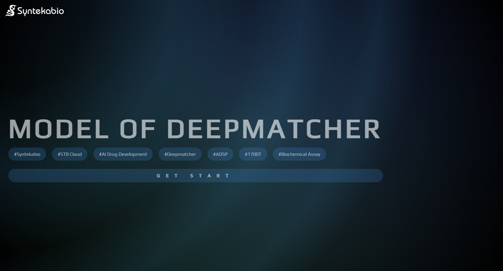
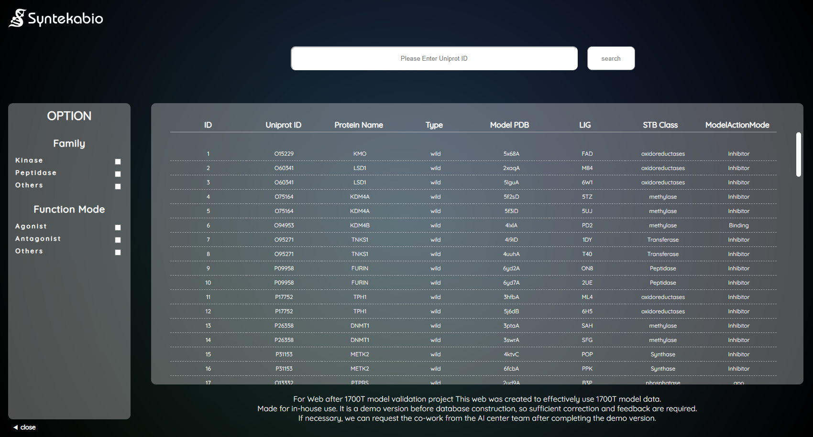
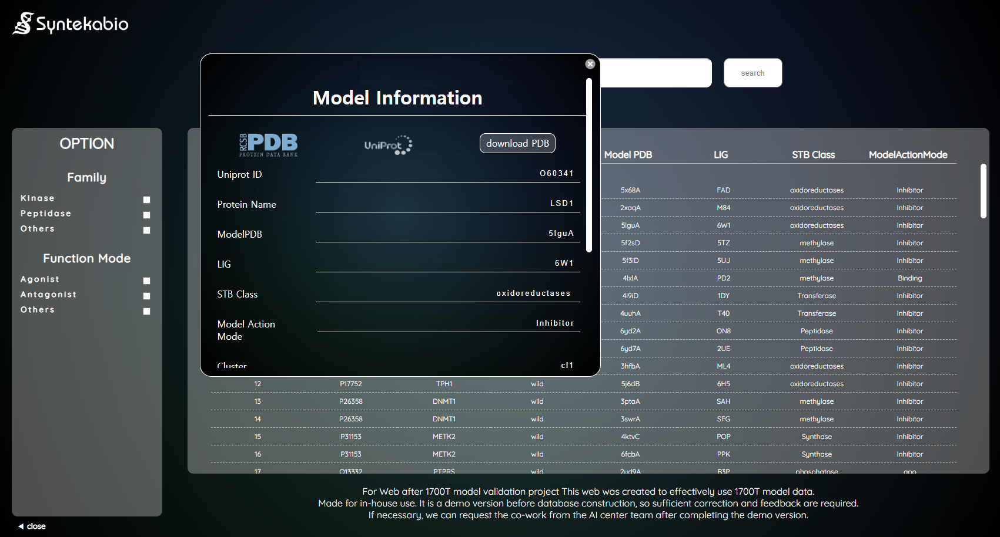

# **Model of Deepmatcher Production Report**

#### Team : AI Drug Development Operation Team
#### Project Manager : JiYoon Shin
#### Project Developer : JeongSoo Na
#### Date : 2023.04.06
#### Estimated required date : 2023.02.01 ~ 2023.04.06

---

### **OBJECT**

1. 확보한 1700T 모델 타겟 유무 확인을 위한 Web Page 구현

2. Deepmatcher 사용 전 관심 타겟의 상세 정보 및 구조 파일, 실험 데이터 확인

3. 다양한 옵션들로 카테고리 분류, 검색 기능을 통한 유연한 데이터 조회

4. 내부 유저 사용을 위한 통합된 사내 타겟 DB 구축

---

### **Overview**

- Main Page
    - Main Banner 및 link 이동을 위한 Navigator

<!--  -->

---

- Database Page
    - 검색 기능
    - Database table 표기
    - 옵션 설정으로 필터링 기능
    <!-- - 하단 Footer에 회사 정보 및 contect, reference 표기 -->
    
<!--  -->

- Database popup
    - 상세내용
    - RCSB, Uniprot, PDB down 기능

<!--  -->

---

### **Process**
1. Project 기획 > 개발일정 설정 > 기능 명세서 작성
2. Web page 구현을 위한 HTML, CSS, Javascript 사용
3. Database : 데이터 양이 많지 않아 사용에 용이한 WebSQL 사용
4. Database Connection : raw data(.csv) 읽은 뒤 Database 생성 및 transaction / executeSql 사용 관리
5. Publishing : Main Page 생성을 통한 기능 확장 및 UI 개선
6. DB Table : HTML table 활용 DB에서 append
7. DB search : Uniprot ID로 검색 기능
8. DB option : Column 및 조회 된 데이터 필터링
9. DB popup : 상세 내용 및 링크, 다운로드 파일 구현
10. Final Inspection : demo version 피드백으로 개선사항 및 최종 raw data 반영
    - ADSP팀, 신지윤 박사님, 허정은 주임님

---

### **Improvements**
- 검색 기능 개선 (Uniprot ID 이 외 다양한 검색 요구)
- 옵션 추가 (다양한 옵션 추가로 편의성 제공)
- 실험가부 및 Assay data 추가
- 단백질 구조 viewer 페이지 및 기능 추가
- 그 외 진행 중 Optional 기능 추가

---

### **Usage Tech**
- HTML
- CSS
- Javascript
- WebSQL
- Installation : VS Code

---

### **Summary**
1700T model validation 프로젝트 완료 시점 Web page에서 쉽게 model 구조 확인 및 실험가부 확인이 가능할 수 있도록 database 구축 및 web page 구현.  
완료 시 STB-Cloud의 DMC-HIT Process 진행 이전 model 확인 및 실험가부에 따른 진행 여부 결정에 도움이 될 것으로 보임.  
1700T model 확인을 위한 optional page로도 사용 가능하나 추후 database 관리 및 새로운 model 확인 시 update 도 가능한 page로 발전 가능.

